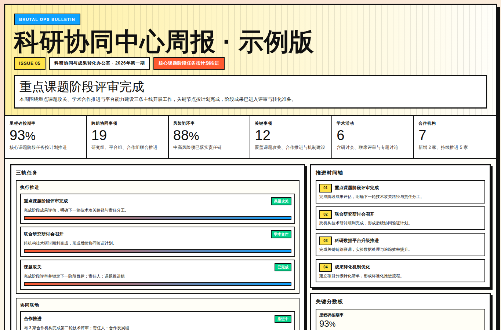
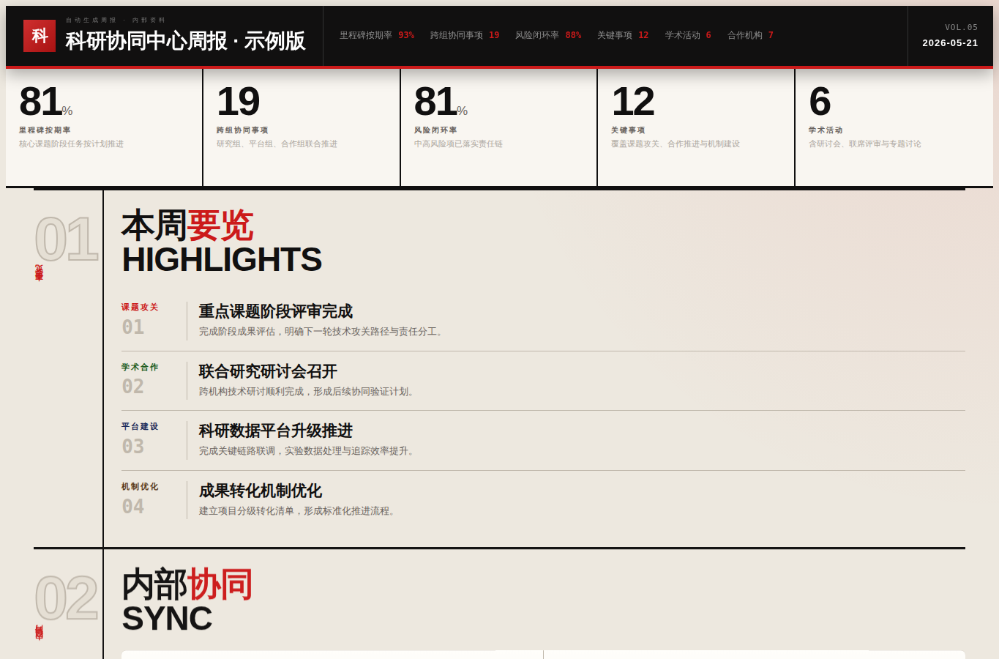
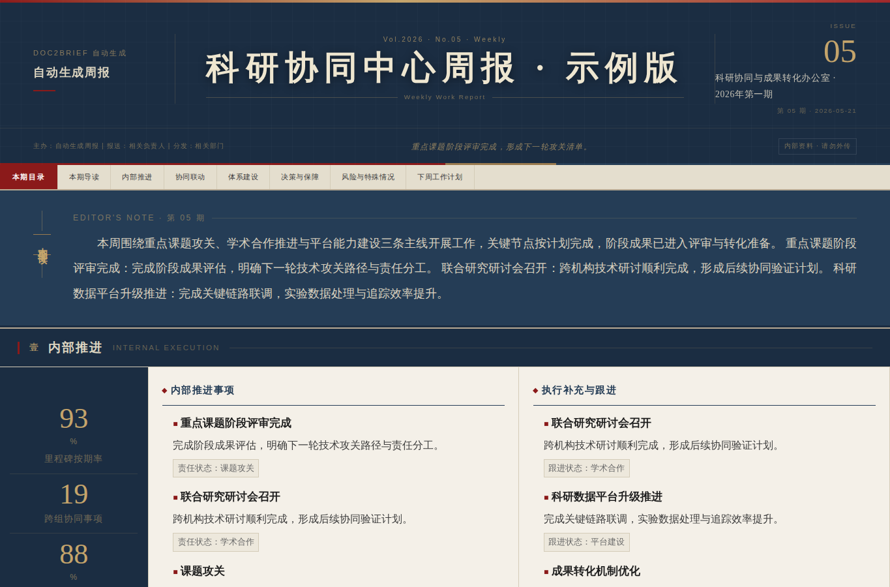
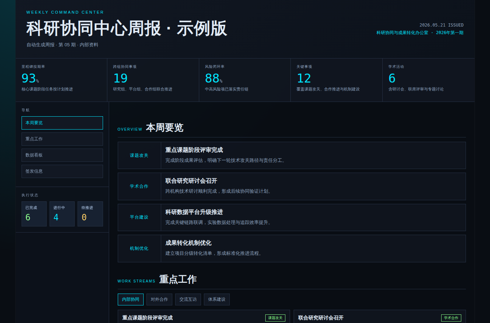
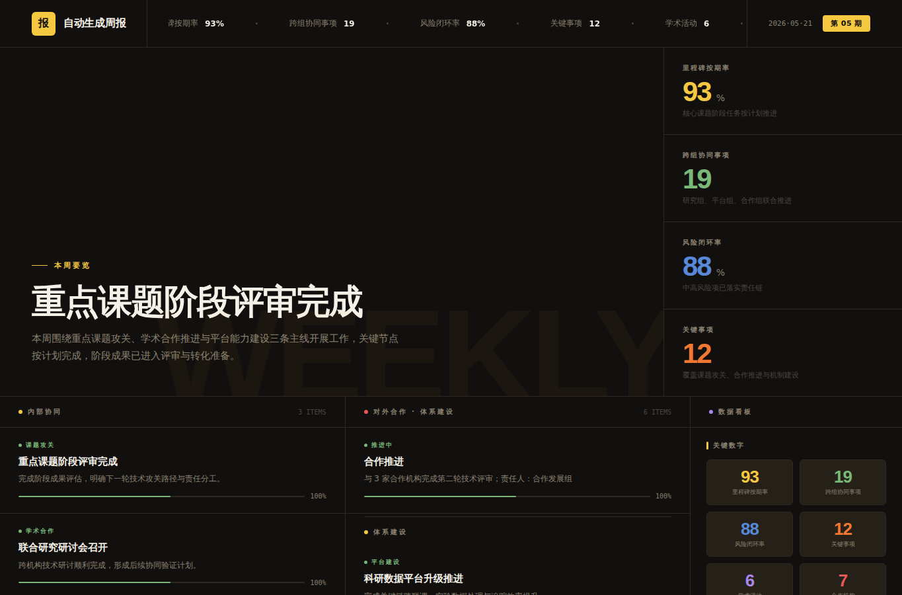
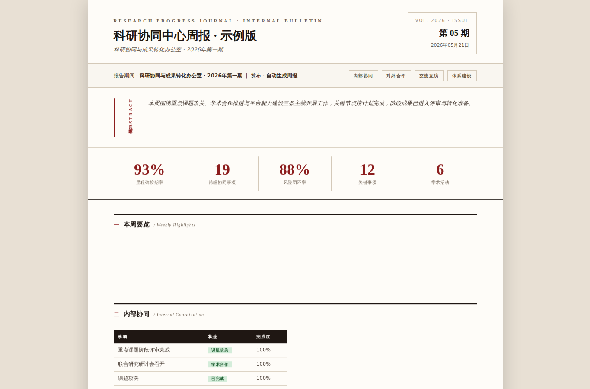
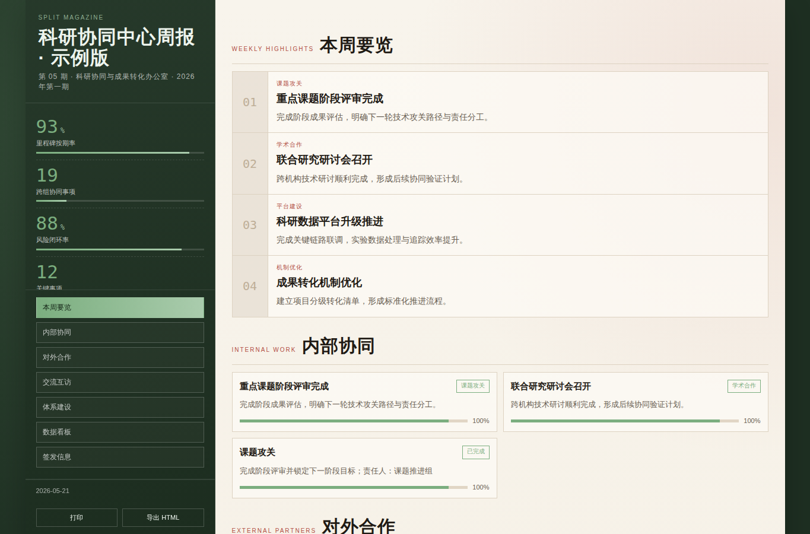

# Doc2Brief

> 把文件或文本转换成可访问、可编辑、可复用的模板化周报链接。


Doc2Brief 是一个 `file / text -> weekly report HTML / poster` 生成平台。它优先解决一个真实工作流：用户把周报文档或零散文字交给系统，系统自动抽取、结构化、匹配主题模板、富化版面内容，最后交付一个可直接访问的周报链接。

当前主链路：

```text
文件/文本 -> 抽取 -> 结构化 -> 自动模板匹配 -> 模板渲染 -> 发布链接 -> 同链接更新
```

## 30 秒开始

```bash
npm install
npm run build
npm run start:prod
```

服务默认运行在：

```text
http://127.0.0.1:5173
```

打开网页后可上传 `PDF / DOCX / DOC / TXT / MD / CSV`，也可以直接粘贴正文生成周报或海报。

Agent / CLI 直接调用：

```bash
node bin/doc2brief.js generate \
  --input ./weekly.md \
  --base-url http://127.0.0.1:5173 \
  --json
```

返回结果包含：

```json
{
  "action": "generate",
  "reportId": "rpt_xxx",
  "shareUrl": "http://127.0.0.1:5173/r/rpt_xxx",
  "templateId": "template-06",
  "templateName": "控制台仪表盘周报"
}
```

## 为什么做这个项目

很多“AI 周报生成”只停留在 prompt 直出 HTML，效果难稳定复用。Doc2Brief 的核心取舍是：模板系统内置，模型或本地解析只负责把内容整理成结构化数据，再由模板运行时稳定渲染。

这让它更适合：

- 团队周报、部门简报、管理汇报
- 科研、行政、战略、运营等不同条线的固定汇报格式
- Agent 自动生成和反复修改同一份报告
- 内网或弱网环境下的本地回退生成

不适合：

- 完全自由创作型网页设计
- 强依赖复杂图表编辑器的可视化大屏
- 需要多人协同权限体系的正式 CMS

## 能力总览

| 能力 | 当前状态 | 说明 |
| --- | --- | --- |
| 文件抽取 | 已支持 | `PDF / DOCX / DOC / TXT / MD / CSV`，旧版 `.doc` 建议转 `.docx` |
| 周报模板生成 | 已支持 | 先结构化，再套内置模板，默认推荐 |
| LLM HTML 直出 | 已支持 | 更自由，但有质量闸门和模板化回退 |
| Agent CLI | 已支持 | `generate` 新建链接，`update` 覆盖同一链接 |
| Agent Skill | 已支持 | `skills/doc2brief-weekly-report/SKILL.md` |
| 海报模式 | 已支持 | brief 提炼 + 图片模型，失败回退本地 SVG 草图 |
| 分享链接 | 已支持 | `/r/<reportId>` 访问已发布 HTML |
| 同链接编辑 | 已支持 | `POST /api/reports/update` 覆盖原 HTML，不创建新文件和新链接 |
| 可观测性 | 已支持 | 业务层 JSON + 系统级日志 |

## 模板图库

Doc2Brief 内置 9 套周报模板。Agent CLI 默认 `--template auto`，会根据文本内容自动匹配；编辑已有报告时默认沿用原模板，避免同一个链接下视觉风格突变。

| 模板 | 预览 | 适合场景 | 业务价值 |
| --- | --- | --- | --- |
| `template-01` 新野兽派战情周报 |  | 冲刺、攻关、专项战役、风险闭环 | 用高对比战情版式突出阶段成果和关键卡点 |
| `template-02` 瑞士网格周报 |  | 数据汇报、经营复盘、指标跟踪 | 用网格秩序提高数字和结论的可读性 |
| `template-03` 电子报刊周报 |  | 正式通报、综合周报、栏目化汇编 | 保留报刊栏栅和导读结构，适合正式阅读 |
| `template-04` 杂志封面周报 |  | 对外展示、品牌汇报、专题复盘 | 增强封面感和传播感，适合展示型材料 |
| `template-05` 国风卷轴周报 |  | 特色汇报、文化活动、仪式感材料 | 用卷轴结构提升识别度和正式感 |
| `template-06` 控制台仪表盘周报 |  | 项目推进、运营周会、上线联调 | 用看板方式呈现进度、状态和风险 |
| `template-07` 新闻简报周报 |  | 快讯、活动动态、内参速览 | 用头条和双列结构承载高密度信息 |
| `template-08` 学术期刊周报 |  | 科研、课题、论文、实验和归档材料 | 用摘要、正文、脚注感增强严谨性 |
| `template-09` 分屏杂志周报 |  | 综合管理、多部门协同、资源协调 | 左侧 KPI 和右侧长内容并行，适合管理例会 |

重新生成图库截图：

```bash
npm run gallery:templates
```

## Agent Skill

仓库内置了可分发的 Agent skill：

```text
skills/doc2brief-weekly-report/SKILL.md
```

安装到本机 Codex skill 目录：

```bash
mkdir -p "${CODEX_HOME:-$HOME/.codex}/skills"
cp -R skills/doc2brief-weekly-report "${CODEX_HOME:-$HOME/.codex}/skills/"
```

典型触发话术：

```text
使用 Doc2Brief 把这个周报文档生成一个可访问链接。
```

```text
基于这个周报链接继续修改内容，不要创建新的链接。
```

Skill 的关键规则：

- 新建报告时调用 `node bin/doc2brief.js generate`
- 修改已有报告时调用 `node bin/doc2brief.js update`
- 如果用户提供了 `/r/<reportId>` 链接或 `reportId`，必须更新原链接
- `update` 会覆盖原 HTML 文件并返回同一个 `shareUrl`
- Agent 工作流使用 `--json`，stdout 保持机器可读，业务 JSON 和系统日志走 stderr

## CLI

### 新建报告

```bash
node bin/doc2brief.js generate \
  --input ./weekly.md \
  --base-url http://127.0.0.1:5173 \
  --json
```

直接传文本：

```bash
node bin/doc2brief.js generate \
  --text "本周完成智能问答平台灰度上线，下周推进验收。" \
  --json
```

指定模板：

```bash
node bin/doc2brief.js generate \
  --input ./weekly.md \
  --template template-08 \
  --json
```

### 修改同一报告链接

```bash
node bin/doc2brief.js update \
  --report-id rpt_xxx \
  --text "补充：新增跨部门资源协调章节，并将上线风险降级为中风险。" \
  --base-url http://127.0.0.1:5173 \
  --json
```

也可以直接传 URL：

```bash
node bin/doc2brief.js update \
  --url http://127.0.0.1:5173/r/rpt_xxx \
  --input ./weekly-revised.md \
  --json
```

CLI 支持输入：

- `txt`
- `md`
- `csv`
- `html`
- `docx`
- `pdf`

## API

### 发布新报告

```http
POST /api/reports/publish
```

请求体：

```json
{
  "title": "智能创新中心周报",
  "html": "<!doctype html>...",
  "generationMode": "agent-skill",
  "templateId": "template-06",
  "generatedAt": "2026/05/21 09:00:00",
  "sourceType": "cli-text"
}
```

### 更新已有报告

```http
POST /api/reports/update
```

请求体：

```json
{
  "reportId": "rpt_xxx",
  "title": "智能创新中心周报",
  "html": "<!doctype html>...",
  "generationMode": "agent-skill",
  "templateId": "template-06"
}
```

### 查询报告元数据

```http
GET /api/reports/meta?reportId=rpt_xxx
```

### 访问报告

```http
GET /r/rpt_xxx
```

## Web 使用

开发环境：

```bash
npm run dev
```

生产一体化服务：

```bash
npm run build
npm run start:prod
```

页面能力：

- 周报模式：模板生成 / LLM HTML 直出
- 海报模式：宣传海报 brief + 图片生成
- 模板切换：生成前预览，生成后导出 HTML
- 分享链接：发布后通过 `/r/<reportId>` 访问
- 用量监控：`/dashboard` 或 `/ops/usage`

## 生成链路

```text
文件/文本输入
  -> 文件抽取（PDF/DOCX/TXT/MD/CSV）
  -> 原文清洗与截断
  -> 结构化解析或模型编排
  -> 自动模板匹配
  -> 模板数据富化
  -> HTML 渲染
  -> 发布或覆盖报告链接
```

回退策略：

- 未配置 API Key：周报链路可走本地结构化解析
- 结构化异常：自动重试和 JSON 修复
- HTML 直出质量不达标：回退“结构化 + 模板渲染”
- 海报图片生成失败：回退本地 SVG 草图

## 可观测性

系统输出两类日志，便于 Agent 和人工排查：

- `业务JSON`：模块输入、关键中间结果、输出摘要
- `系统日志` / `系统日志-错误`：模块启动、关键调用、耗时、异常、重试、降级、最终状态

覆盖模块：

- 文件抽取
- 模型编排
- 模板匹配
- 报告发布
- 报告更新
- 海报编排
- API 用量监控

## 环境变量

OpenRouter：

- `OPENROUTER_API_KEY`
- `OPENROUTER_BASE_URL`
- `OPENROUTER_HTML_MODEL`
- `OPENROUTER_STRUCTURED_MODEL`
- `OPENROUTER_POLISH_MODEL`
- `OPENROUTER_POSTER_BRIEF_MODEL`
- `OPENROUTER_POSTER_IMAGE_MODEL`
- `OPENROUTER_HTML_MAX_TOKENS`
- `OPENROUTER_PROMPT_PROFILE`

服务与存储：

- `REPORT_SERVER_HOST`：默认 `0.0.0.0`
- `REPORT_SERVER_PORT`：默认 `5173`
- `PUBLIC_SHARE_BASE_URL`：外部访问域名，不配置时自动根据请求推导
- `REPORT_BODY_LIMIT_BYTES`：发布/更新请求体上限，默认 `6291456`
- `REPORT_RETENTION_DAYS`：报告保留天数，默认 `30`
- `REPORT_MAX_COUNT`：报告最大保留条数，默认 `500`
- `REPORT_CLEANUP_ON_STARTUP`：启动时是否清理
- `REPORT_CLEANUP_ON_PUBLISH`：发布后是否后台清理

Agent / CLI：

- `DOC2BRIEF_BASE_URL`：CLI 默认服务地址
- `MAX_SOURCE_CHARS`：参与生成的最大字符数，默认 `18000`

用量监控：

- `USAGE_RETENTION_DAYS`
- `USAGE_MAX_RECORDS`
- `USAGE_CLEANUP_ON_WRITE`
- `OPENROUTER_MODEL_PRICING_JSON`

硅基流动兜底：

- `SILICONFLOW_API_KEY`
- `SILICONFLOW_BASE_URL`
- `SILICONFLOW_MODEL`

## 验证

Skill 结构校验：

```bash
python3 ~/.codex/skills/.system/skill-creator/scripts/quick_validate.py skills/doc2brief-weekly-report
```

Agent 主链路集成验证：

```bash
npm run verify:agent-skill
```

该验证会真实执行：

```text
启动服务 -> CLI 生成报告 -> 发布链接 -> 查询元数据 -> CLI 更新同一 reportId -> 访问同一链接
```

前端构建：

```bash
npm run build
```

模板截图：

```bash
npm run gallery:templates
```
